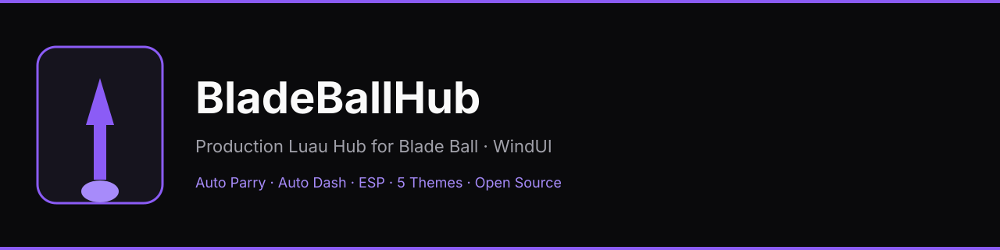

<p align="center">
  
</p>

<p align="center">
  <strong>Production-oriented Luau hub for Roblox Blade Ball</strong><br>
  Built with <a href="https://github.com/Footagesus/WindUI">WindUI</a> · Modular · Clean architecture
</p>

<p align="center">
  <a href="https://github.com/ideBob/BladeBallHub/archive/refs/heads/main.zip"></a>
  &nbsp;
  <a href="https://idebob.github.io/BladeBallHub/"></a>
  &nbsp;
  <a href="src/BladeBallHub.lua"></a>
</p>

<p align="center">
  
  
  
  
</p>

---

## Overview

BladeBallHub is a focused, modular script hub for **Blade Ball**. It provides velocity-based Auto Parry, Auto Dash, Ball Tracker, ESP, quality-of-life utilities, and a five-theme UI system — all behind a single WindUI window with proper state management and cleanup.

| Area | Highlights |
|------|------------|
| **Combat** | Auto Parry (prediction), Auto Dash, Ball Tracker |
| **Utilities** | Infinite Jump, No Fog, Full Bright, Remove Jitter, ESP |
| **UI** | Main · Parry · Theme tabs · 5 palettes |
| **Architecture** | Central state, connection manager, BallController, capability detection |

---

## Features

### Main
- **Infinite Jump** — event-driven jump requests with character respawn support
- **No Fog** — removes fog/atmosphere with safe restore
- **Full Bright** — forced bright lighting with original-value restore
- **Remove Jitter** — lightweight camera spike dampening
- **ESP** — player highlights, distance, and health
- **Debug Mode** — throttled diagnostics

### Parry
- **Auto Parry** — velocity-based prediction with configurable distance, reaction time, and prediction strength
- **Auto Dash** — evasive dash when the ball is a threat
- **Ball Tracker** — live overlay (speed, distance, approaching, ETA)
- Sliders for Parry Distance, Reaction Time, Prediction Strength, Min Ball Speed, Max Distance, Dash Distance

### UI Theme / Color Changer
- Runtime themes: **Lavender**, **Purple**, **Violet**, **White**, **Black** (default)
- Applied via `WindUI:SetTheme` — no feature reset, no full UI rebuild

---

## Download Source Code

<p align="center">
  <a href="https://github.com/ideBob/BladeBallHub/archive/refs/heads/main.zip">
    
  </a>
</p>

| Resource | Link |
|----------|------|
| **Repository** | [github.com/ideBob/BladeBallHub](https://github.com/ideBob/BladeBallHub) |
| **Main script** | [`src/BladeBallHub.lua`](src/BladeBallHub.lua) |
| **ZIP archive** | [Download main as ZIP](https://github.com/ideBob/BladeBallHub/archive/refs/heads/main.zip) |
| **Raw script** | [raw.githubusercontent.com/.../BladeBallHub.lua](https://raw.githubusercontent.com/ideBob/BladeBallHub/main/src/BladeBallHub.lua) |
| **Website** | [idebob.github.io/BladeBallHub](https://idebob.github.io/BladeBallHub/) |

---

## Usage

1. Open Roblox and join **Blade Ball**.
2. Inject your preferred executor.
3. Execute the contents of [`src/BladeBallHub.lua`](src/BladeBallHub.lua)  
   (or load from the raw URL above).

The window opens with three tabs: **Main**, **Parry**, and **UI THEME / COLOR CHANGER**.

```lua
-- Optional one-liner (loads latest from this repository)
loadstring(game:HttpGet("https://raw.githubusercontent.com/ideBob/BladeBallHub/main/src/BladeBallHub.lua"))()
```

---

## Architecture

- Centralized **State** and **Config**
- **Connection manager** — track / disconnect on feature disable or window destroy
- **BallController** — single source of truth for the active ball
- Feature isolation via `pcall`
- Capability detection for executor-specific APIs
- Full cleanup on `Window:OnDestroy`

### Dependencies

| Dependency | Source |
|------------|--------|
| **WindUI** | Loaded at runtime from [Footagesus/WindUI](https://github.com/Footagesus/WindUI) releases |

WindUI is **not** vendored. The hub always fetches the latest release:

```lua
local WindUI = loadstring(game:HttpGet(
  "https://github.com/Footagesus/WindUI/releases/latest/download/main.lua"
))()
```

---

## Repository layout

```text
BladeBallHub/
├── README.md
├── LICENSE
├── CHANGELOG.md
├── .gitignore
├── src/
│   └── BladeBallHub.lua      # Complete executable hub
├── assets/
│   ├── banner.svg
│   ├── logo.svg
│   └── icon-parry.svg
├── config/
│   └── Config.lua
├── docs/
│   └── Features.md
├── website/                  # GitHub Pages site
│   ├── index.html
│   ├── css/
│   ├── js/
│   └── assets/
└── .github/workflows/
    └── pages.yml
```

---

## Documentation

- [Feature reference](docs/Features.md) — detailed behavior of every toggle and slider
- [Changelog](CHANGELOG.md) — version history
- [Config defaults](config/Config.lua) — shared configuration table

---

## Credits

- **WindUI** by [Footagesus](https://github.com/Footagesus/WindUI) — UI framework
- Blade Ball by the original game developers

---

## Disclaimer

This project is for educational and personal use. Using scripts in Roblox may violate the Roblox Terms of Service and can result in account moderation. Use at your own risk on accounts you can afford to lose.

---

## License

MIT License — see [LICENSE](LICENSE).

WindUI remains under its own MIT license (Footagesus/WindUI).
