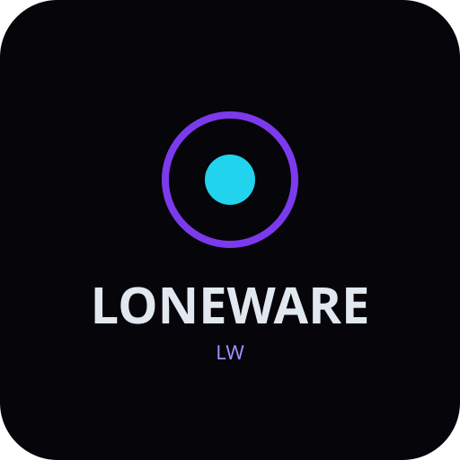

<p align="center">
  
</p>

<h1 align="center">LoneWare</h1>

<p align="center">
  <strong>A polished, modular Roblox Blade Ball script hub</strong><br>
  Built with <a href="https://github.com/Footagesus/WindUI">WindUI</a>
</p>

<p align="center">
  <a href="https://github.com/ideBob/BladeBallHub/archive/refs/heads/main.zip"></a>
  &nbsp;
  <a href="src/LoneWare.lua"></a>
  &nbsp;
  <a href="docs/"></a>
  &nbsp;
  <a href="https://github.com/ideBob/BladeBallHub/issues"></a>
</p>

<p align="center">
  
  
  
  
</p>

<p align="center">
  <a href="#about">About</a> ·
  <a href="#features">Features</a> ·
  <a href="#installation">Installation</a> ·
  <a href="#usage">Usage</a> ·
  <a href="#configuration">Configuration</a> ·
  <a href="#project-structure">Structure</a> ·
  <a href="#documentation">Docs</a> ·
  <a href="#changelog">Changelog</a> ·
  <a href="#disclaimer">Disclaimer</a>
</p>

---

## About

LoneWare is a production-oriented Luau hub for **Blade Ball**. It focuses on clear feature isolation, safe enable/disable lifecycle, connection cleanup, and a WindUI interface with Main, Parry, Theme, and FFlag tabs.

| | |
|---|---|
| **Combat** | Auto Parry, Auto Dash, Ball Tracker |
| **Utilities** | Infinite Jump, No Fog, Full Bright, Remove Jitter, ESP, Debug Mode |
| **UI** | Four tabs · five themes · notifications |
| **FFlag** | JSON editor, validation, presets, rejoin (no setfflag) |
| **Architecture** | SafeCall · Logger · ConnectionManager · References · Unload |

---

## Features

### Main
| Feature | Description |
|---------|-------------|
| **Infinite Jump** | Event-driven jump requests; rebinds on respawn |
| **No Fog** | Clears fog/atmosphere with restore on disable |
| **Full Bright** | Forced bright lighting with original-value restore |
| **Remove Jitter** | Softens large short camera spikes only |
| **ESP** | Highlights, distance, health; cleaned on leave/disable |
| **Debug Mode** | Throttled diagnostics via LoneWare logger |
| **RakNet Desync** | Experimental; capability-gated |

### Parry
| Feature | Description |
|---------|-------------|
| **Auto Parry** | Velocity prediction · configurable distance / reaction / strength |
| **Auto Dash** | Cooldown-gated evasive impulse when the ball is a threat |
| **Ball Tracker** | Overlay: speed, distance, approach, ETA |

### UI Theme
Lavender · Purple · Violet · White · **Black** (default) — applied at runtime via WindUI.

### FFlag
JSON configuration editor with validation, status line, Apply (store validated config only), Rejoin, Clear/Reset, presets, and clipboard import/export. **Does not** call executor `setfflag` or implement anti-cheat bypasses.

---

## Showcase

<p align="center">
  
</p>

<p align="center"><em>Official full-color logo: place at <code>assets/logo/loneware-logo.png</code>. UI screenshots: <code>assets/screenshots/</code>.</em></p>

---

## Installation

1. Download the source ([ZIP](https://github.com/ideBob/BladeBallHub/archive/refs/heads/main.zip) or clone).
2. Open [`src/LoneWare.lua`](src/LoneWare.lua).
3. Join **Blade Ball** in Roblox.
4. Inject your executor and run the script.

**One-liner** (when the file is on <code>main</code>):

```lua
loadstring(game:HttpGet("https://raw.githubusercontent.com/ideBob/BladeBallHub/main/src/LoneWare.lua"))()
```

---

## Usage

| Tab | Contents |
|-----|----------|
| **Main** | Utilities + ESP + Debug |
| **Parry** | Auto Parry, Auto Dash, Ball Tracker, sliders |
| **UI THEME** | Theme dropdown |
| **FFlag** | JSON editor, validate/apply, rejoin, presets |

Close the window to unload: features disable, connections disconnect, temporary UI is destroyed.

---

## Configuration

| Setting | Default | Range |
|---------|---------|-------|
| Parry Distance | 12 | 4–30 |
| Reaction Time | 0.05 | 0.01–0.25 |
| Prediction Strength | 0.75 | 0.1–1.5 |
| Minimum Ball Speed | 10 | 0–80 |
| Max Ball Distance | 120 | 30–250 |
| Auto Dash Distance | 15 | 5–40 |

See [docs/configuration.md](docs/configuration.md).

---

## Requirements

- Roblox **Blade Ball**
- Luau executor with <code>HttpGet</code> / <code>loadstring</code>
- Network access to load **WindUI** ([Footagesus/WindUI](https://github.com/Footagesus/WindUI))

---

## Project Structure

```text
BladeBallHub/
├── README.md
├── LICENSE
├── CHANGELOG.md
├── CONTRIBUTING.md
├── src/
│   └── LoneWare.lua
├── assets/
│   └── logo/
├── config/
│   └── Config.lua
├── docs/
├── website/
└── .github/
```

---

## Documentation

- [Installation](docs/installation.md)
- [Features](docs/features.md)
- [Configuration](docs/configuration.md)
- [Troubleshooting](docs/troubleshooting.md)
- [Changelog](CHANGELOG.md)
- [Contributing](CONTRIBUTING.md)

---

## Changelog

See [CHANGELOG.md](CHANGELOG.md).

**v1.0.0** — Initial LoneWare release.

---

## Contributing

See [CONTRIBUTING.md](CONTRIBUTING.md) and [issues](https://github.com/ideBob/BladeBallHub/issues).

---

## Disclaimer

This project is for educational and personal use. Using scripts in Roblox may violate the Roblox Terms of Service and can result in account moderation. Use at your own risk on accounts you can afford to lose.

---

## Credits

- **WindUI** — [Footagesus/WindUI](https://github.com/Footagesus/WindUI)
- Blade Ball — original game developers
- LoneWare branding — project author

---

## License

MIT — see [LICENSE](LICENSE).
